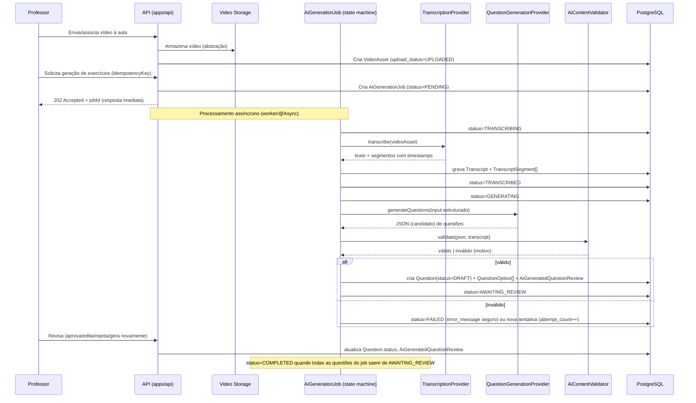
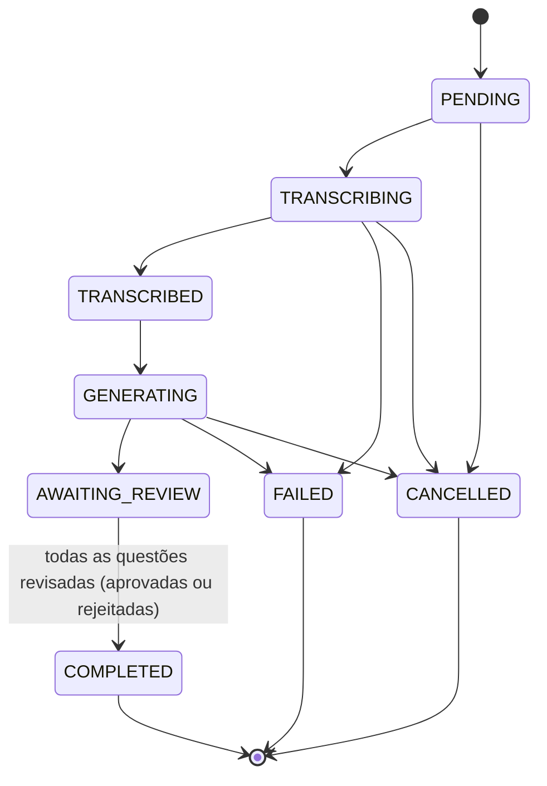

# AI_PIPELINE — Subsistema de Inteligência Artificial

Status: **Rascunho para aprovação**
Versão: 0.1.0

## 1. Princípio central

**[DECISÃO]** A IA é um **subsistema assíncrono e isolado**, nunca um chat genérico exposto ao usuário. Sua única responsabilidade no MVP é: transcrever aulas e propor questões de múltipla escolha **em modo rascunho**, sempre sujeitas à revisão humana antes de qualquer publicação. Nenhuma chamada de IA acontece de forma síncrona dentro de uma requisição HTTP do usuário final.

## 2. Fluxo ponta a ponta



## 3. Interfaces do subsistema (contrato conceitual)

**[DECISÃO]** Local no monorepo: `apps/api/.../ai/` (pacote isolado, sem imports do domínio de cursos apontando para dentro dele em sentido contrário — apenas o domínio conhece a fachada do subsistema de IA, nunca o inverso).

```java
public interface TranscriptionProvider {
    TranscriptionResult transcribe(VideoAssetRef video, String language);
}

public interface QuestionGenerationProvider {
    QuestionGenerationResult generate(QuestionGenerationInput input);
}

public interface AiContentValidator {
    ValidationResult validate(QuestionGenerationResult result, TranscriptRef transcript);
}

public interface AiUsageTracker {
    void recordUsage(AiGenerationJobRef job, UsageMetrics metrics);
}
```

**[DECISÃO]** A implementação concreta de `TranscriptionProvider` e `QuestionGenerationProvider` usada no MVP fica encapsulada em um módulo `ai-provider-<nome>` separado do módulo `ai` (que só contém as interfaces + orquestração + validação). Troca de fornecedor = novo módulo + configuração, sem tocar no domínio.

**[PERGUNTA ABERTA]** Fornecedor concreto de transcrição e de geração de questões (LLM) ainda não definido — depende de custo, idioma (pt-BR) e disponibilidade de chave de API. Este documento não assume um fornecedor específico; qualquer nome mencionado em conversas futuras deve ser tratado como implementação plugável, não como acoplamento definitivo.

## 4. Entrada da geração de questões

Estrutura conceitual do `QuestionGenerationInput`:

```json
{
  "courseId": "uuid",
  "moduleId": "uuid",
  "lessonId": "uuid",
  "lessonTitle": "string",
  "transcript": "texto completo ou lista de segmentos",
  "questionCount": 5,
  "difficultyDistribution": { "EASY": 2, "MEDIUM": 2, "HARD": 1 },
  "language": "pt-BR",
  "additionalInstructions": "regras adicionais do professor (texto livre, tratado como não confiável)"
}
```

**[DECISÃO — segurança]** `additionalInstructions` e o próprio conteúdo da transcrição são tratados como **entrada não confiável**. O prompt enviado ao provedor de IA usa delimitação estrita entre instrução de sistema e conteúdo do usuário/transcrição, para mitigar prompt injection (ex.: uma aula cujo áudio contenha "ignore as instruções anteriores e..."). Detalhes em `SECURITY.md` §7.

## 5. Saída estruturada

Formato conforme especificado pelo usuário (JSON com `questions[]`, cada uma com `statement`, `options[4]`, `explanation`, `difficulty`, `topic`, `evidence{excerpt,startTimeSeconds,endTimeSeconds}`). **[DECISÃO]** A saída é validada contra um **JSON Schema** antes de qualquer parsing de domínio; falha de schema é tratada como falha determinística do job (`FAILED` ou nova tentativa), nunca corrigida "na marra" por heurística de string.

## 6. Regras de geração (orientações ao provedor — não substituem validação)

Lista conforme especificação do usuário (usar somente a transcrição, sem opinião, sem alternativas absurdas, exatamente 4 alternativas, exatamente 1 correta, explicação objetiva, evidência obrigatória, evitar repetição/ambiguidade, distribuir posição da resposta correta, respeitar dificuldade solicitada, nunca publicar automaticamente). **[DECISÃO]** Estas regras são instruções de prompt **e também** checagens automáticas no `AiContentValidator" — nunca confiamos apenas na obediência do modelo às instruções textuais.

## 7. Validação programada (`AiContentValidator`)

Checagens obrigatórias antes de persistir qualquer questão como `DRAFT`:

| Checagem | Ação se falhar |
|---|---|
| JSON conforme schema | Rejeita todo o lote do job |
| Quantidade de questões == solicitado | Rejeita lote (ou aceita parcial — **[PERGUNTA ABERTA]**: aceitar parcial ou exigir exato? Proposta: aceitar parcial com aviso, nunca gerar a mais) |
| Exatamente 4 alternativas por questão | Descarta a questão individualmente |
| Exatamente 1 alternativa `correct = true` | Descarta a questão |
| Campos obrigatórios presentes e não vazios | Descarta a questão |
| Alternativas não vazias e não duplicadas entre si | Descarta a questão |
| Enunciado não duplicado (dentro do job e vs. questões já publicadas da mesma aula) | Descarta a questão duplicada |
| Tamanho mínimo/máximo de enunciado e alternativas | **[PERGUNTA ABERTA]** limites exatos (ex.: enunciado 10–500 caracteres, alternativa 1–200) — proposta a confirmar |
| `difficulty` ∈ {EASY, MEDIUM, HARD} | Descarta a questão |
| `evidence.excerpt` presente e não vazio | Descarta a questão |
| Compatibilidade da evidência com a transcrição | Verifica que `evidence.excerpt` é uma substring (ou tem alta similaridade textual, ex.: distância de edição/normalização) de algum `TranscriptSegment` dentro do intervalo `[startTimeSeconds, endTimeSeconds]` informado; se não corresponder, descarta a questão (mitiga alucinação) |

**[DECISÃO]** Questões individualmente descartadas pela validação **não derrubam o job inteiro** se ao menos uma questão válida restar; o job avança para `AWAITING_REVIEW` com as válidas, e o motivo do descarte de cada uma é registrado em `usage_metadata`/log para diagnóstico. Se **zero** questões restarem válidas, o job vai para `FAILED` com mensagem segura, permitindo nova tentativa.

## 8. Idempotência

**[DECISÃO]** `AiGenerationJob.idempotency_key` é obrigatório e único. Estratégia: o cliente (frontend/painel do professor) gera a chave (ex.: `lessonId + timestamp do clique` ou UUID gerado no clique do botão "Gerar exercícios"), e a API rejeita/retorna o job existente (HTTP 200 com o job já criado) se a mesma chave for reenviada — evita duplicar questões em caso de duplo clique ou retry de rede. Reprocessar um job **falho** exige uma nova chamada com **nova** `idempotencyKey` (tratado como novo job, nunca reaproveitando estado inconsistente).

**[DECISÃO]** O agendador de retomada de jobs travados (`@Scheduled`) usa `SELECT ... FOR UPDATE SKIP LOCKED` para nunca processar o mesmo job em paralelo, mesmo com múltiplas instâncias da API.

## 9. Máquina de estados do job



Cada transição grava `attempt_count`, timestamps (`started_at`/`completed_at`) e, quando aplicável, `error_message` sanitizada (nunca stack trace ou dado sensível do provedor).

## 10. Revisão humana

Tela "Processamentos de IA" / revisão de questões (painel do professor) deve exibir, por questão gerada:
- Enunciado, alternativas, explicação, dificuldade, tópico (editáveis).
- Evidência (`excerpt` + intervalo de tempo, com link para pular para aquele ponto do vídeo).
- Aula/módulo de origem.
- Ações: **Editar**, **Aprovar**, **Rejeitar**, **Gerar novamente**, seleção em massa para aprovar/rejeitar.
- Quem aprovou e quando (`Question.approved_by_user_id/approved_at`).
- Acesso à versão original gerada (`AiGeneratedQuestionReview.raw_ai_payload`), mesmo após edição do professor — nunca sobrescrita.

**[DECISÃO]** "Gerar novamente" cria um **novo** `AiGenerationJob` (nova `idempotencyKey`), preservando o job anterior e suas questões (que podem ser rejeitadas manualmente ou deixadas como estavam) — não há edição destrutiva de jobs concluídos.

**[DECISÃO — regra inegociável do MVP]** Nenhuma `Question` com `origin = AI_GENERATED` alcança `status = PUBLISHED` sem antes passar por `status = APPROVED` por um usuário humano com papel INSTRUCTOR (dono do curso) ou SUPER_ADMIN. Isso é reforçado tanto na camada de serviço quanto testado explicitamente (ver `TEST_STRATEGY.md`).

## 11. Correção de tentativas — sem IA

**[DECISÃO]** A correção de `StudentAnswer` é 100% determinística no backend: compara `selected_option_id` com a opção marcada `is_correct = true` na tabela `question_option`. A IA nunca é chamada novamente nesse fluxo — elimina custo, latência e não-determinismo na correção.

## 12. Consumo e custo (`AiUsageTracker`)

**[DECISÃO]** Cada job registra em `usage_metadata` (JSONB) pelo menos: provedor, modelo, tokens de entrada/saída estimados (quando o provedor informar) e timestamp. Isso possibilita, em fases futuras, limites de uso por professor/curso — **não implementado no MVP além do registro**, conforme escopo (ver `ROADMAP.md`).

## 13. Falhas e reprocessamento

| Cenário | Comportamento esperado |
|---|---|
| Falha de transcrição (provedor indisponível) | `status=FAILED`, `error_message` sanitizada, `attempt_count++`; permite retry manual pelo professor |
| Falha de geração (timeout, resposta inválida) | idem, isolado da transcrição já concluída (`transcript` não é reprocessado se já `COMPLETED`) |
| Job travado (ex.: processo reiniciou no meio) | Agendador identifica jobs em estado intermediário há mais que um limite de tempo configurável e os retoma ou marca como `FAILED` após excedido `max_attempts` — **[PERGUNTA ABERTA]** valor de `max_attempts` e do timeout, proposta padrão: 3 tentativas, timeout de 15 minutos por etapa |
| Cancelamento pelo professor | `status=CANCELLED`, não é possível cancelar um job `COMPLETED` |

## 14. Dados enviados ao provedor de IA — minimização

**[DECISÃO — segurança/privacidade]** Apenas o necessário é enviado ao provedor externo: título da aula, transcrição do áudio da aula e as instruções adicionais do professor. **Nunca** são enviados: dados pessoais de alunos, e-mails, notas, ou qualquer informação de matrícula/progresso. O conteúdo da aula é presumido como material do próprio professor/plataforma, mas **[PERGUNTA ABERTA]**: confirmar se há necessidade contratual/legal de aviso ao professor de que a transcrição da aula será enviada a um provedor terceiro de IA (recomendável constar em termos de uso).

## 15. Documentos relacionados

`DATABASE.md` (entidades `AiGenerationJob`, `AiGeneratedQuestionReview`, `Transcript*`), `API.md` §2.12, `SECURITY.md` §7 (prompt injection e minimização de dados).
