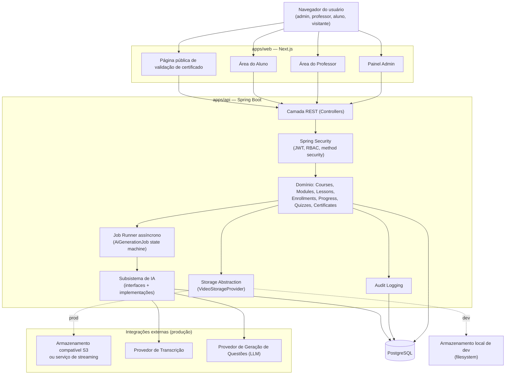
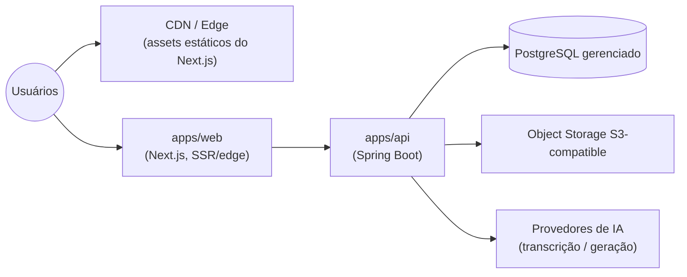

# ARCHITECTURE — Arquitetura Técnica

Status: **Rascunho para aprovação**
Versão: 0.1.0

Convenções `[DECISÃO]` / `[SUPOSIÇÃO]` / `[PERGUNTA ABERTA]` conforme definidas em `PRD.md`.

## 1. Estilo arquitetural

**[DECISÃO]** Monorepo com dois aplicativos (`web` e `api`) e um subsistema de IA **isolado logicamente** dentro da API (não como domínio acoplado). Justificativa:
- MVP com equipe pequena: um monorepo reduz overhead operacional versus múltiplos repositórios.
- O subsistema de IA precisa ser substituível (múltiplos provedores) sem vazar detalhes de fornecedor para o domínio de cursos — por isso vive atrás de interfaces (`TranscriptionProvider`, `QuestionGenerationProvider`, `AiContentValidator`, `AiUsageTracker`), mesmo rodando no mesmo processo/deploy do backend principal no MVP.
- Não adotamos microsserviços no MVP: a complexidade operacional (orquestração, observabilidade distribuída) não se justifica para o estágio atual do produto. A arquitetura é modular internamente para permitir extração futura de serviços (ex.: worker de IA como serviço separado) sem reescrever o domínio.

## 2. Estrutura de monorepo

```
/apps
  /web            # Next.js (App Router) — painel admin, área do professor, área do aluno, página pública de certificado
  /api            # Spring Boot — domínio, autenticação, subsistema de IA, jobs assíncronos
/docs             # Documentação técnica (este conjunto de arquivos)
/infra
  docker-compose.yml   # Postgres + api + web para ambiente local
  ...configurações locais (ex.: pasta de armazenamento de vídeo local)
```

**[DECISÃO]** `apps/web` e `apps/api` são deployáveis de forma independente (dois processos/containers), mesmo vivendo no mesmo monorepo. Isso evita acoplar o ciclo de release do frontend ao backend.

## 3. Stack tecnológica e versões

**[DECISÃO — a confirmar/pinar na Fase 0]** Versões estáveis (LTS quando aplicável) na data de início do projeto:

| Camada | Tecnologia | Versão alvo |
|---|---|---|
| Frontend | Next.js | 14.x (App Router) |
| Frontend | React | 18.x |
| Frontend | TypeScript | 5.4+ |
| Frontend | Tailwind CSS | 3.4+ |
| Frontend | Componentes | shadcn/ui (Radix UI + Tailwind) |
| Frontend | Formulários/validação | React Hook Form + Zod |
| Frontend | Cliente HTTP | Cliente tipado gerado a partir do OpenAPI da API (ex.: `openapi-typescript` + wrapper `fetch` central) |
| Frontend | Gerenciador de pacotes | pnpm (workspaces) |
| Backend | Java | 21 (LTS) |
| Backend | Spring Boot | 3.3.x |
| Backend | Spring Security | incluso no Boot 3.3.x |
| Backend | Spring Data JPA / Hibernate | incluso no Boot 3.3.x |
| Backend | Bean Validation | Hibernate Validator (Jakarta Validation 3.x) |
| Backend | Migrações | Flyway 10.x |
| Backend | Documentação de API | springdoc-openapi 2.x |
| Backend | Testes | JUnit 5, Mockito 5, Testcontainers 1.19+ |
| Backend | Build | Maven (multi-módulo) ou Gradle — **[PERGUNTA ABERTA]**: confirmar preferência; proposta padrão: Maven, por maior familiaridade média em times Spring |
| Banco | PostgreSQL | 16.x |
| Infra local | Docker Compose | — |

**[SUPOSIÇÃO]** shadcn/ui foi escolhido por ser acessível (baseado em Radix), altamente customizável (código copiado para o projeto, sem "cara de template genérico") e compatível com Tailwind — atende ao requisito de UI "profissional, moderna, sem aparência genérica". Alternativa considerada e descartada por ora: Material UI (visual mais "padrão", menos flexível para identidade própria).

## 4. Diagrama de arquitetura (visão de componentes)



## 5. Subsistema de IA — princípio de isolamento

**[DECISÃO]** O domínio de cursos nunca chama um SDK de provedor de IA diretamente. Toda comunicação passa por interfaces definidas no módulo `ai` da API:

```
TranscriptionProvider        -> transcreve um VideoAsset em Transcript + TranscriptSegment[]
QuestionGenerationProvider    -> gera questões estruturadas a partir de uma transcrição
AiContentValidator            -> valida estrutural e semanticamente a saída da IA
AiUsageTracker                 -> registra consumo/custo por job, para auditoria e limites
```

Isso permite trocar o provedor concreto (ex.: outro fornecedor de transcrição ou de LLM) sem alterar o domínio de cursos, exercícios ou revisão. Detalhamento completo em `AI_PIPELINE.md`.

## 6. Processamento assíncrono

**[DECISÃO — MVP]** Sem message broker dedicado (Kafka/RabbitMQ/SQS) no MVP. Usamos:
- Tabela `ai_generation_job` como fonte de verdade do estado (state machine persistida).
- `@Async` do Spring + um `TaskExecutor` dedicado para dar início ao processamento sem bloquear a requisição HTTP.
- Um agendador (`@Scheduled`) para retomar jobs travados/retentar falhas transitórias, respeitando `attempt_count` e backoff.

Justificativa: reduz complexidade operacional para a escala inicial (poucos professores, geração sob demanda, não é streaming de eventos de alto volume). **[SUPOSIÇÃO]** Volume esperado no MVP é baixo (dezenas de jobs/dia, não milhares). Se este pressuposto mudar, a migração para uma fila real (ex.: SQS, RabbitMQ) é viável sem reescrever o domínio, pois o `JobRunner` já é uma camada isolada.

**[PERGUNTA ABERTA]** Confirmar se have múltiplas instâncias da API rodarão em paralelo em produção desde o início — isso afeta se é necessário lock distribuído (ex.: `SELECT ... FOR UPDATE SKIP LOCKED`) para o agendador não processar o mesmo job duas vezes. Proposta: já implementar `FOR UPDATE SKIP LOCKED` na consulta de jobs pendentes, mesmo com uma única instância, por ser barato e evitar retrabalho futuro.

## 7. Armazenamento de vídeo

**[DECISÃO]** Abstração `VideoStorageProvider` com pelo menos duas implementações:

- **Local (dev)**: grava arquivo no filesystem local (pasta configurável via variável de ambiente, ex.: `./infra/local-storage/videos`), servido por um endpoint autenticado da API que verifica matrícula antes de liberar o stream (sem URL pública direta).
- **Produção**: implementação compatível com S3 (AWS S3, Cloudflare R2, MinIO etc.) usando **URLs assinadas de curta duração** para leitura, geradas sob demanda após verificação de matrícula/autorização. **[PERGUNTA ABERTA]**: confirmar se produção usará upload direto para o storage (presigned upload URL) ou upload via API — proposta padrão: presigned upload URL para evitar tráfego de binários grandes pela API.
- Interface deixa espaço para uma terceira implementação futura (serviço especializado de streaming, ex.: Mux/Cloudflare Stream) sem alterar o domínio de `Lesson`/`VideoAsset`.

Nenhum binário de vídeo é armazenado no PostgreSQL.

## 8. Autenticação e sessão

**[DECISÃO]**
- Autenticação via **JWT** (access token de curta duração, ex.: 15 min) + **refresh token** (maior duração, ex.: 7 dias), este último armazenado em cookie `httpOnly`, `Secure`, `SameSite=Lax/Strict` para mitigar XSS/CSRF.
- Autorização por papel e por posse (ownership) usando `@PreAuthorize` do Spring Security nos controllers/serviços, nunca apenas checagem no frontend.
- Front-end nunca guarda o access token em `localStorage` (mitigação de XSS); mantém em memória/estado do app, renovando via endpoint de refresh.

## 9. Requisitos não funcionais (MVP)

| Categoria | Requisito |
|---|---|
| Disponibilidade | Ambiente único de produção no MVP, sem HA multi-região (fora de escopo) |
| Observabilidade | Logs estruturados; auditoria de ações administrativas (`AuditLog`); **[PERGUNTA ABERTA]** ferramenta de APM/observabilidade externa não definida |
| Internacionalização | `[SUPOSIÇÃO]` MVP em pt-BR apenas; campo `language` já modelado no pipeline de IA para permitir expansão futura |
| Acessibilidade | Componentes baseados em Radix (shadcn/ui) para suporte a teclado/leitor de tela por padrão |
| Performance | Sem metas numéricas definidas ainda — **[PERGUNTA ABERTA]** |
| Escalabilidade | Arquitetura modular permite extrair o subsistema de IA como serviço próprio no futuro, sem reescrever o domínio |

## 10. Ambiente local (infra)

`infra/docker-compose.yml` (a ser criado na Fase 0) deve subir:
- PostgreSQL 16 com volume persistente e usuário/senha via variáveis de ambiente (nunca hardcoded).
- `apps/api` (perfil `dev`) apontando para o Postgres local e para a implementação local de storage de vídeo.
- `apps/web` apontando para a API local.

Segredos (chaves de provedor de IA, credenciais de storage) nunca entram no `docker-compose.yml` versionado — apenas referências a variáveis de ambiente, com `.env.example` documentando as chaves esperadas sem valores reais (ver `SECURITY.md`).

## 11. Diagrama de deployment (alvo de produção, conceitual)



**[PERGUNTA ABERTA]** Provedor de hospedagem para produção (AWS, GCP, Azure, Railway, Fly.io, VPS próprio) ainda não definido. Este documento não assume um provedor específico; a arquitetura é agnóstica de nuvem por design (uso de S3-compatible, Postgres padrão, containers).

## 12. Documentos relacionados

Ver `DATABASE.md`, `API.md`, `AI_PIPELINE.md`, `SECURITY.md`.
