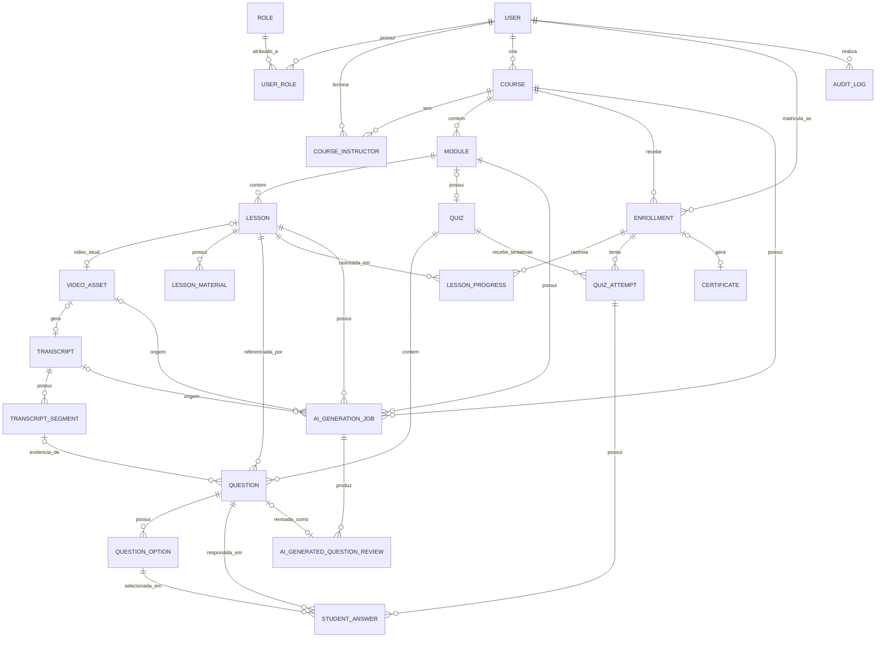

# DATABASE — Modelo de Dados

Status: **Rascunho para aprovação**
Versão: 0.1.0
Banco alvo: PostgreSQL 16

Convenções `[DECISÃO]` / `[SUPOSIÇÃO]` / `[PERGUNTA ABERTA]` conforme `PRD.md`.

## 1. Estratégia de identificação

**[DECISÃO]** Todas as tabelas de domínio usam **UUID v4** (`gen_random_uuid()`, extensão `pgcrypto` ou função nativa do Postgres 16) como chave primária.

Justificativa:
- Evita vazar volume/sequência de registros (ex.: quantidade de cursos, alunos) em URLs públicas — relevante especialmente para `Certificate` (validação pública) e para endpoints de vídeo.
- Permite gerar identificadores no cliente/serviço antes de persistir, útil para idempotência (ex.: `AiGenerationJob`) e para desacoplar criação de registros relacionados em transações distribuídas futuras.
- Facilita merge/replicação entre ambientes sem colisão de chave.

Trade-off aceito: índices um pouco maiores e menor localidade física que `BIGSERIAL`. Mitigação: colunas de auditoria (`created_at`) indexadas separadamente quando necessário para consultas ordenadas por tempo.

**[DECISÃO]** Tabelas puramente de referência/lookup fixas (ex.: `role`) também usam UUID por consistência, mas são seed via Flyway com poucos registros, então o custo é irrelevante.

**[DECISÃO]** `Certificate.validation_code` é um **código curto separado da UUID** (ex.: 10–12 caracteres alfanuméricos, gerado com alto contraste visual — sem O/0/I/1 confusos), pensado para digitação manual e QR Code, sem expor o UUID interno do registro.

## 2. Convenções gerais

- Nomes de tabela em `snake_case`, singular (ex.: `course`, `lesson`).
- Toda tabela tem `created_at TIMESTAMPTZ NOT NULL DEFAULT now()`.
- Tabelas mutáveis relevantes têm `updated_at TIMESTAMPTZ NOT NULL DEFAULT now()` mantido por trigger ou pela camada JPA (`@PreUpdate`).
- **[DECISÃO]** Timestamps sempre em `TIMESTAMPTZ` (UTC), conversão de fuso feita na apresentação (frontend/relatórios).
- Enums de domínio (`status`, `difficulty`, etc.) são modelados como `VARCHAR` com `CHECK CONSTRAINT`, não como tipo nativo `ENUM` do Postgres — **[DECISÃO]**: `ENUM` nativo do Postgres é custoso de alterar (requer `ALTER TYPE`), e o projeto está em fase inicial com alta chance de novos valores; `VARCHAR + CHECK` é mais simples de evoluir via migração Flyway padrão.

## 3. Soft delete — onde se aplica

**[DECISÃO]** Regra geral: **soft delete (`deleted_at TIMESTAMPTZ NULL`)** é usado sempre que o registro pode ter histórico acadêmico, financeiro ou de auditoria referenciado por outras tabelas. Exclusão física é permitida apenas para registros efêmeros ou sem repercussão histórica.

| Entidade | Estratégia | Justificativa |
|---|---|---|
| User | Soft delete (`deleted_at`) + `status` (`ACTIVE`/`BLOCKED`) | Bloqueio lógico não deve apagar histórico acadêmico (requisito explícito) |
| Course | Soft delete | Pode ter matrículas, progresso, certificados associados |
| Module | Soft delete | Pode ter aulas com progresso associado |
| Lesson | Soft delete | Pode ter progresso e questões associadas |
| VideoAsset | Nunca deletado fisicamente; substituído por novo registro (ver §5.7) | Preserva histórico de uploads/trocas de vídeo |
| LessonMaterial | Soft delete | Simples, mas mantém rastreabilidade |
| Question | Soft delete condicional: exclusão física só é permitida se **não houver** `StudentAnswer` associada; caso contrário, soft delete | Preserva integridade de tentativas já respondidas |
| Enrollment | Nunca deletado; apenas transições de `status` (`ACTIVE`→`SUSPENDED`/`CANCELLED`/`EXPIRED`) | Necessário para relatórios e para o próprio certificado referenciar a matrícula |
| LessonProgress | Nunca deletado | Histórico de progresso do aluno |
| QuizAttempt / StudentAnswer | Nunca deletado, imutável após submissão | Integridade de avaliação/correção |
| Certificate | Nunca deletado; `revoked_at` para revogação lógica | Validação pública deve poder identificar certificados revogados sem apagar histórico |
| AiGenerationJob / AiGeneratedQuestionReview | Nunca deletado | Auditoria do pipeline de IA |
| AuditLog | Nunca deletado | É, por definição, o registro de auditoria |
| CourseInstructor, Module order helpers, etc. | Exclusão física permitida (tabelas de vínculo sem histórico próprio) | Baixo risco |

## 4. Diagrama entidade-relacionamento



## 5. Entidades

### 5.1 `user`

| Coluna | Tipo | Regras |
|---|---|---|
| id | UUID | PK |
| name | VARCHAR(150) | NOT NULL |
| email | VARCHAR(255) | NOT NULL, UNIQUE (case-insensitive via índice `LOWER(email)`) |
| password_hash | VARCHAR(255) | NOT NULL (bcrypt/argon2, nunca texto plano) |
| status | VARCHAR(20) | NOT NULL DEFAULT `ACTIVE`; CHECK IN (`ACTIVE`, `BLOCKED`) |
| last_login_at | TIMESTAMPTZ | NULL |
| created_at / updated_at | TIMESTAMPTZ | NOT NULL |
| deleted_at | TIMESTAMPTZ | NULL |

Índices: `UNIQUE (LOWER(email)) WHERE deleted_at IS NULL`; índice em `status`.

### 5.2 `role` / `user_role`

`role`: `id UUID PK`, `code VARCHAR(30) UNIQUE NOT NULL` (`SUPER_ADMIN`, `INSTRUCTOR`, `STUDENT`), `description VARCHAR(255)`.

`user_role`: `user_id UUID FK -> user`, `role_id UUID FK -> role`, `created_at`. PK composta `(user_id, role_id)`.

**[SUPOSIÇÃO]** Relação N:N para suportar usuários com múltiplos papéis (ver `PRD.md` §5). Seed inicial dos 3 papéis via migração Flyway.

### 5.3 `course`

| Coluna | Tipo | Regras |
|---|---|---|
| id | UUID | PK |
| title | VARCHAR(200) | NOT NULL |
| slug | VARCHAR(220) | UNIQUE NOT NULL (usado em URLs públicas) |
| description | TEXT | NULL |
| cover_image_url | VARCHAR(500) | NULL |
| workload_hours | NUMERIC(6,2) | NOT NULL (mínimo 0,5h na aplicação — obrigatório para certificado) |
| status | VARCHAR(20) | NOT NULL DEFAULT `DRAFT`; CHECK IN (`DRAFT`, `PUBLISHED`, `ARCHIVED`) |
| min_completion_percentage | NUMERIC(5,2) | NOT NULL DEFAULT 100 |
| min_passing_score | NUMERIC(5,2) | NOT NULL DEFAULT 70 |
| certificate_enabled | BOOLEAN | NOT NULL DEFAULT true |
| max_quiz_attempts | INT | NULL (NULL = ilimitado) |
| created_by_user_id | UUID | FK -> user, NOT NULL |
| published_at | TIMESTAMPTZ | NULL |
| archived_at | TIMESTAMPTZ | NULL |
| created_at / updated_at | TIMESTAMPTZ | NOT NULL |
| deleted_at | TIMESTAMPTZ | NULL |

**[DECISÃO]** "Despublicar" transiciona `PUBLISHED -> DRAFT` (não existe estado `UNPUBLISHED` separado no MVP). **[PERGUNTA ABERTA]**: confirmar se é necessário distinguir "nunca publicado" de "já publicado e despublicado" para efeitos de analytics; se sim, adicionar `was_published_before BOOLEAN`.

Índices: `UNIQUE(slug)`, índice em `status`, índice em `created_by_user_id`.

### 5.4 `course_instructor`

| Coluna | Tipo | Regras |
|---|---|---|
| id | UUID | PK |
| course_id | UUID | FK -> course, NOT NULL |
| instructor_user_id | UUID | FK -> user, NOT NULL |
| is_primary | BOOLEAN | NOT NULL DEFAULT true |
| created_at | TIMESTAMPTZ | NOT NULL |

Índice único: `(course_id, instructor_user_id)`.

### 5.5 `module`

| Coluna | Tipo | Regras |
|---|---|---|
| id | UUID | PK |
| course_id | UUID | FK -> course, NOT NULL |
| title | VARCHAR(200) | NOT NULL |
| description | TEXT | NULL |
| order_index | INT | NOT NULL |
| status | VARCHAR(20) | NOT NULL DEFAULT `DRAFT`; CHECK IN (`DRAFT`, `PUBLISHED`) |
| created_at / updated_at | TIMESTAMPTZ | NOT NULL |
| deleted_at | TIMESTAMPTZ | NULL |

Índice: `(course_id, order_index)` — **[DECISÃO]** não é `UNIQUE` rígido a nível de banco (reordenação em lote geraria violação transitória); a consistência de ordem é garantida pela camada de serviço dentro de uma transação, reatribuindo todos os `order_index` do curso.

### 5.6 `lesson`

| Coluna | Tipo | Regras |
|---|---|---|
| id | UUID | PK |
| module_id | UUID | FK -> module, NOT NULL |
| title | VARCHAR(200) | NOT NULL |
| description | TEXT | NULL |
| order_index | INT | NOT NULL |
| duration_seconds | INT | NULL |
| access_type | VARCHAR(20) | NOT NULL DEFAULT `ENROLLED_ONLY`; CHECK IN (`FREE_PREVIEW`, `ENROLLED_ONLY`) |
| status | VARCHAR(20) | NOT NULL DEFAULT `DRAFT`; CHECK IN (`DRAFT`, `PUBLISHED`) |
| current_video_asset_id | UUID | FK -> video_asset, NULL |
| created_at / updated_at | TIMESTAMPTZ | NOT NULL |
| deleted_at | TIMESTAMPTZ | NULL |

Índice: `(module_id, order_index)`.

### 5.7 `video_asset`

| Coluna | Tipo | Regras |
|---|---|---|
| id | UUID | PK |
| lesson_id | UUID | FK -> lesson, NULL (associado quando o upload é concluído) |
| storage_provider | VARCHAR(30) | NOT NULL; CHECK IN (`LOCAL_DEV`, `S3_COMPATIBLE`, `EXTERNAL_STREAMING`) |
| storage_key | VARCHAR(500) | NOT NULL |
| original_filename | VARCHAR(255) | NULL |
| mime_type | VARCHAR(100) | NULL |
| size_bytes | BIGINT | NULL |
| duration_seconds | INT | NULL |
| upload_status | VARCHAR(20) | NOT NULL DEFAULT `PENDING`; CHECK IN (`PENDING`, `UPLOADING`, `UPLOADED`, `FAILED`) |
| processing_status | VARCHAR(20) | NOT NULL DEFAULT `PENDING`; CHECK IN (`PENDING`, `PROCESSING`, `READY`, `FAILED`) |
| failure_reason | VARCHAR(500) | NULL (mensagem segura, sem stack trace) |
| checksum | VARCHAR(128) | NULL |
| created_at / updated_at | TIMESTAMPTZ | NOT NULL |

**[DECISÃO]** Substituir o vídeo de uma aula **cria um novo registro** `video_asset` e atualiza `lesson.current_video_asset_id`; o registro antigo permanece no banco (não é apagado), preservando histórico de uploads e o vínculo com `Transcript`/`AiGenerationJob` que porventura já existam para ele. Índice em `lesson_id`.

### 5.8 `lesson_material`

| Coluna | Tipo | Regras |
|---|---|---|
| id | UUID | PK |
| lesson_id | UUID | FK -> lesson, NOT NULL |
| title | VARCHAR(200) | NOT NULL |
| storage_provider | VARCHAR(30) | NOT NULL |
| storage_key | VARCHAR(500) | NOT NULL |
| mime_type | VARCHAR(100) | NULL |
| size_bytes | BIGINT | NULL |
| order_index | INT | NOT NULL DEFAULT 0 |
| created_at | TIMESTAMPTZ | NOT NULL |
| deleted_at | TIMESTAMPTZ | NULL |

### 5.9 `transcript`

| Coluna | Tipo | Regras |
|---|---|---|
| id | UUID | PK |
| video_asset_id | UUID | FK -> video_asset, UNIQUE NOT NULL |
| language | VARCHAR(10) | NOT NULL |
| full_text | TEXT | NULL (preenchido ao concluir) |
| status | VARCHAR(20) | NOT NULL DEFAULT `PENDING`; CHECK IN (`PENDING`, `PROCESSING`, `COMPLETED`, `FAILED`) |
| provider | VARCHAR(100) | NULL |
| created_at | TIMESTAMPTZ | NOT NULL |
| completed_at | TIMESTAMPTZ | NULL |

### 5.10 `transcript_segment`

| Coluna | Tipo | Regras |
|---|---|---|
| id | UUID | PK |
| transcript_id | UUID | FK -> transcript, NOT NULL |
| sequence_index | INT | NOT NULL |
| start_time_seconds | NUMERIC(10,2) | NOT NULL |
| end_time_seconds | NUMERIC(10,2) | NOT NULL |
| text | TEXT | NOT NULL |
| topic | VARCHAR(255) | NULL |

Índice único: `(transcript_id, sequence_index)`.

### 5.11 `quiz`

**[SUPOSIÇÃO — a confirmar]** Quiz é modelado no nível de **módulo** (um quiz agrega questões de várias aulas do módulo), refletindo o mockup "Exercício do módulo" da área do aluno, enquanto cada `Question` mantém referência à aula específica de origem.

| Coluna | Tipo | Regras |
|---|---|---|
| id | UUID | PK |
| module_id | UUID | FK -> module, UNIQUE NOT NULL |
| title | VARCHAR(200) | NULL |
| status | VARCHAR(20) | NOT NULL DEFAULT `DRAFT`; CHECK IN (`DRAFT`, `PUBLISHED`) |
| passing_score | NUMERIC(5,2) | NULL (sobrepõe padrão do curso) |
| max_attempts | INT | NULL (sobrepõe padrão do curso) |
| created_at / updated_at | TIMESTAMPTZ | NOT NULL |
| deleted_at | TIMESTAMPTZ | NULL |

### 5.12 `question`

| Coluna | Tipo | Regras |
|---|---|---|
| id | UUID | PK |
| quiz_id | UUID | FK -> quiz, NOT NULL |
| lesson_id | UUID | FK -> lesson, NOT NULL |
| transcript_segment_id | UUID | FK -> transcript_segment, NULL (obrigatório quando `origin = AI_GENERATED`) |
| statement | TEXT | NOT NULL, tamanho mín./máx. validado na aplicação |
| explanation | TEXT | NULL |
| difficulty | VARCHAR(10) | NOT NULL; CHECK IN (`EASY`, `MEDIUM`, `HARD`) |
| topic | VARCHAR(255) | NULL |
| status | VARCHAR(20) | NOT NULL DEFAULT `DRAFT`; CHECK IN (`DRAFT`, `APPROVED`, `REJECTED`, `PUBLISHED`) |
| origin | VARCHAR(20) | NOT NULL; CHECK IN (`MANUAL`, `AI_GENERATED`) |
| ai_generation_job_id | UUID | FK -> ai_generation_job, NULL |
| order_index | INT | NOT NULL DEFAULT 0 |
| approved_by_user_id | UUID | FK -> user, NULL |
| approved_at | TIMESTAMPTZ | NULL |
| created_at | TIMESTAMPTZ | NOT NULL |
| deleted_at | TIMESTAMPTZ | NULL |

Regra de negócio (aplicação): `status = PUBLISHED` somente se `approved_by_user_id IS NOT NULL`; questões `AI_GENERATED` nunca vão de `DRAFT` direto para `PUBLISHED` sem passar por `APPROVED`.

### 5.13 `question_option`

| Coluna | Tipo | Regras |
|---|---|---|
| id | UUID | PK |
| question_id | UUID | FK -> question, NOT NULL |
| text | VARCHAR(500) | NOT NULL |
| is_correct | BOOLEAN | NOT NULL DEFAULT false |
| order_index | INT | NOT NULL |

**[DECISÃO]** Índice único parcial para garantir **no máximo uma alternativa correta por questão a nível de banco**, além da validação de aplicação:

```sql
CREATE UNIQUE INDEX uq_question_option_correct
  ON question_option (question_id)
  WHERE is_correct = true;
```

A regra "exatamente 4 alternativas" e "exatamente uma correta" (não zero) é validada na camada de aplicação/serviço no momento de publicar a questão, pois exigem contagem (não expressável em `CHECK` simples do Postgres sem trigger). **[DECISÃO]** optamos por validação de aplicação em vez de trigger, para manter a lógica de negócio testável em Java/JUnit e centralizada; o índice parcial acima cobre o caso mais crítico (nunca duas corretas) mesmo em caminhos de escrita não previstos.

### 5.14 `enrollment`

| Coluna | Tipo | Regras |
|---|---|---|
| id | UUID | PK |
| student_user_id | UUID | FK -> user, NOT NULL |
| course_id | UUID | FK -> course, NOT NULL |
| status | VARCHAR(20) | NOT NULL DEFAULT `ACTIVE`; CHECK IN (`ACTIVE`, `SUSPENDED`, `CANCELLED`, `EXPIRED`) |
| started_at | TIMESTAMPTZ | NOT NULL DEFAULT now() |
| completed_at | TIMESTAMPTZ | NULL (conclusão formal do curso pelo aluno — pré-requisito do certificado) |
| expires_at | TIMESTAMPTZ | NULL |
| granted_by_user_id | UUID | FK -> user, NULL |
| created_at / updated_at | TIMESTAMPTZ | NOT NULL |

**[DECISÃO]** `UNIQUE(student_user_id, course_id)` — um único registro de matrícula por par aluno/curso; reativações/suspensões são transições de `status`, não novas linhas. Isso simplifica a consulta "o aluno tem acesso a este curso?" para uma checagem direta, mas implica que o **histórico de suspensões/reativações não é versionado na própria linha** — mudanças de status relevantes são registradas em `AuditLog`. **[PERGUNTA ABERTA]**: confirmar se é necessário um histórico completo de mudanças de status de matrícula além do audit log genérico.

### 5.15 `lesson_progress`

| Coluna | Tipo | Regras |
|---|---|---|
| id | UUID | PK |
| enrollment_id | UUID | FK -> enrollment, NOT NULL |
| lesson_id | UUID | FK -> lesson, NOT NULL |
| status | VARCHAR(20) | NOT NULL DEFAULT `NOT_STARTED`; CHECK IN (`NOT_STARTED`, `IN_PROGRESS`, `COMPLETED`) |
| last_position_seconds | INT | NOT NULL DEFAULT 0 |
| started_at | TIMESTAMPTZ | NULL |
| completed_at | TIMESTAMPTZ | NULL |
| updated_at | TIMESTAMPTZ | NOT NULL |

`UNIQUE(enrollment_id, lesson_id)`. Regra de conclusão detalhada em `PRD.md` §7 (pendente confirmação).

### 5.16 `quiz_attempt`

| Coluna | Tipo | Regras |
|---|---|---|
| id | UUID | PK |
| enrollment_id | UUID | FK -> enrollment, NOT NULL |
| quiz_id | UUID | FK -> quiz, NOT NULL |
| attempt_number | INT | NOT NULL |
| status | VARCHAR(20) | NOT NULL DEFAULT `IN_PROGRESS`; CHECK IN (`IN_PROGRESS`, `SUBMITTED`, `GRADED`) |
| started_at | TIMESTAMPTZ | NOT NULL |
| submitted_at | TIMESTAMPTZ | NULL |
| score | NUMERIC(5,2) | NULL |
| passed | BOOLEAN | NULL |

`UNIQUE(enrollment_id, quiz_id, attempt_number)`. `attempt_number` calculado pela aplicação em transação (evita duas tentativas simultâneas com mesmo número).

### 5.17 `student_answer`

| Coluna | Tipo | Regras |
|---|---|---|
| id | UUID | PK |
| quiz_attempt_id | UUID | FK -> quiz_attempt, NOT NULL |
| question_id | UUID | FK -> question, NOT NULL |
| selected_option_id | UUID | FK -> question_option, NOT NULL |
| is_correct | BOOLEAN | NOT NULL (calculado no momento da resposta, deterministicamente) |
| answered_at | TIMESTAMPTZ | NOT NULL |

`UNIQUE(quiz_attempt_id, question_id)` — impede múltiplas respostas para a mesma questão na mesma tentativa. Imutável após `quiz_attempt.status = SUBMITTED`.

### 5.18 `certificate`

| Coluna | Tipo | Regras |
|---|---|---|
| id | UUID | PK |
| enrollment_id | UUID | FK -> enrollment, UNIQUE NOT NULL |
| student_user_id | UUID | FK -> user, NOT NULL |
| course_id | UUID | FK -> course, NOT NULL |
| validation_code | VARCHAR(32) | UNIQUE NOT NULL |
| status | VARCHAR(20) | NOT NULL DEFAULT `ISSUED`; CHECK IN (`ISSUED`, `REVOKED`) |
| issued_at | TIMESTAMPTZ | NOT NULL |
| completion_date | DATE | NOT NULL |
| student_name_snapshot | VARCHAR(150) | NOT NULL |
| course_title_snapshot | VARCHAR(200) | NOT NULL |
| workload_hours_snapshot | NUMERIC(6,2) | NOT NULL |
| coordinator_name_snapshot | VARCHAR(150) | NOT NULL |
| chief_vision_officer_name_snapshot | VARCHAR(150) | NOT NULL |
| pdf_path | VARCHAR(500) | NULL |
| validation_url | VARCHAR(500) | NOT NULL |
| revoked_at | TIMESTAMPTZ | NULL |
| created_at / updated_at | TIMESTAMPTZ | NOT NULL |

**[DECISÃO]** Certificado é **institucional da plataforma** (não do instrutor do curso). Snapshots no momento da emissão: aluno, título do curso, carga horária, coordenador (Rafael Kienen) e CVO (Pedro Honorio). Sem `instructor_name`. Índice em `validation_code` para a página pública. Um certificado por matrícula (`UNIQUE enrollment_id`); reemissão retorna o existente.

### 5.19 `ai_generation_job`

| Coluna | Tipo | Regras |
|---|---|---|
| id | UUID | PK |
| course_id | UUID | FK -> course, NOT NULL |
| module_id | UUID | FK -> module, NOT NULL |
| lesson_id | UUID | FK -> lesson, NOT NULL |
| video_asset_id | UUID | FK -> video_asset, NULL |
| transcript_id | UUID | FK -> transcript, NULL |
| status | VARCHAR(20) | NOT NULL DEFAULT `PENDING`; CHECK IN (`PENDING`, `TRANSCRIBING`, `TRANSCRIBED`, `GENERATING`, `AWAITING_REVIEW`, `COMPLETED`, `FAILED`, `CANCELLED`) |
| provider | VARCHAR(100) | NULL |
| model | VARCHAR(100) | NULL |
| requested_question_count | INT | NOT NULL |
| difficulty_distribution | JSONB | NULL |
| language | VARCHAR(10) | NOT NULL |
| extra_instructions | TEXT | NULL |
| idempotency_key | VARCHAR(100) | UNIQUE NOT NULL |
| attempt_count | INT | NOT NULL DEFAULT 0 |
| error_message | VARCHAR(500) | NULL (sanitizado) |
| usage_metadata | JSONB | NULL (tokens/custo estimado, ver `AiUsageTracker`) |
| requested_by_user_id | UUID | FK -> user, NOT NULL |
| created_at | TIMESTAMPTZ | NOT NULL |
| started_at | TIMESTAMPTZ | NULL |
| completed_at | TIMESTAMPTZ | NULL |

Detalhe da máquina de estados e da estratégia de idempotência em `AI_PIPELINE.md`.

### 5.20 `ai_generated_question_review`

| Coluna | Tipo | Regras |
|---|---|---|
| id | UUID | PK |
| ai_generation_job_id | UUID | FK -> ai_generation_job, NOT NULL |
| question_id | UUID | FK -> question, UNIQUE NOT NULL |
| raw_ai_payload | JSONB | NOT NULL, imutável (snapshot da saída original da IA) |
| reviewed_by_user_id | UUID | FK -> user, NULL |
| review_status | VARCHAR(20) | NOT NULL DEFAULT `PENDING`; CHECK IN (`PENDING`, `APPROVED`, `REJECTED`, `REGENERATED`) |
| review_notes | TEXT | NULL |
| reviewed_at | TIMESTAMPTZ | NULL |
| created_at | TIMESTAMPTZ | NOT NULL |

`raw_ai_payload` preserva a "versão original gerada pela IA" mesmo que o professor edite o `question.statement`/opções depois — atende ao requisito explícito de rastreabilidade.

### 5.21 `audit_log`

| Coluna | Tipo | Regras |
|---|---|---|
| id | UUID | PK |
| actor_user_id | UUID | FK -> user, NULL (NULL = ação do sistema) |
| action | VARCHAR(100) | NOT NULL (ex.: `COURSE_PUBLISHED`, `USER_BLOCKED`, `QUESTION_APPROVED`) |
| entity_type | VARCHAR(100) | NOT NULL |
| entity_id | UUID | NOT NULL |
| metadata | JSONB | NULL |
| ip_address | VARCHAR(45) | NULL |
| created_at | TIMESTAMPTZ | NOT NULL |

Índices: `(entity_type, entity_id)`, `(actor_user_id)`, `(created_at)`.

## 6. Índices adicionais recomendados (consultas frequentes)

- `enrollment (student_user_id, status)` — "meus cursos ativos".
- `lesson_progress (enrollment_id, status)` — cálculo de progresso agregado.
- `question (quiz_id, status)` — listagem de questões publicadas por quiz.
- `ai_generation_job (status)` — fila de processamento/monitoramento no painel de IA.
- `course (status) WHERE deleted_at IS NULL` — listagem pública de cursos publicados.

## 7. Migrações

**[DECISÃO]** Flyway como única ferramenta de migração; nenhuma alteração de schema fora de arquivos versionados `V{n}__descricao.sql`. `ddl-auto` do Hibernate desabilitado em todos os ambientes (`validate` apenas, nunca `update`/`create`).

## 8. Documentos relacionados

`ARCHITECTURE.md`, `API.md`, `AI_PIPELINE.md`, `SECURITY.md`, `DECISIONS.md`.
