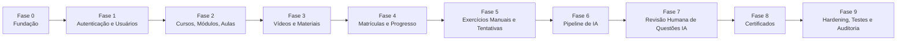

# ROADMAP — Fases de Entrega

Status: **Rascunho para aprovação**
Versão: 0.1.0

Nenhuma fase abaixo será iniciada até o recebimento explícito de **"ARQUITETURA APROVADA"**. Após aprovação, cada fase deve ser concluída, testada e revisada antes de iniciar a próxima ("trabalhar em fases pequenas e verificáveis" — regra do projeto). Uma fase não é considerada concluída com erros de compilação ou testes quebrados.

## Fora do escopo inicial (não implementar no MVP)

Aplicativo móvel; rede social; chat entre alunos; lives; marketplace de professores; programa de afiliados; gamificação complexa; pagamento e assinatura automática; integração automática com Meta Ads/Google Ads; tutor de IA conversacional; fine-tuning; treinamento de modelo próprio; publicação automática de questões sem revisão. A arquitetura deve permitir evolução para estes itens no futuro, mas nenhum deles é construído especulativamente agora.

## Visão geral das fases

## Fase 0 — Fundação

**Objetivo:** preparar monorepo, ambiente local, esqueleto de projeto, sem funcionalidade de negócio.

Escopo:
- Estrutura de pastas (`/apps/web`, `/apps/api`, `/infra`, `/docs`).
- Projeto Spring Boot inicial (health check, configuração de perfis `dev`/`prod`, conexão com Postgres via variáveis de ambiente).
- Projeto Next.js inicial (layout base, Tailwind, shadcn/ui configurado).
- `docker-compose.yml` com Postgres 16 local.
- Flyway configurado com migração inicial vazia/baseline.
- `.env.example` (backend e frontend) e `.gitignore` cobrindo segredos.
- CI mínimo (build + lint + testes) — **[PERGUNTA ABERTA]** provedor de CI (GitHub Actions presumido, a confirmar).

Critérios de aceite:
- `docker compose up` sobe Postgres local sem erros.
- API sobe localmente e responde a um endpoint de health check.
- Web sobe localmente e renderiza uma página inicial.
- Build de ambos os apps sem erros; nenhum teste quebrado (ainda que poucos existam nesta fase).
- Nenhum segredo real versionado.

## Fase 1 — Autenticação e Usuários

Escopo: entidades `User`, `Role`, `UserRole`; cadastro, login, logout, refresh, recuperação/alteração de senha; bloqueio lógico; RBAC básico (`@PreAuthorize`); `AuditLog` para ações de bloqueio/desbloqueio e mudança de papel.

Critérios de aceite:
- Cadastro e login funcionam ponta a ponta (web ↔ api ↔ banco).
- Rotas protegidas retornam 401/403 corretamente para usuário não autenticado/sem papel adequado.
- Senha nunca trafega em log nem é recuperável (apenas reset).
- Bloqueio lógico de conta impede login sem apagar o usuário.
- Testes automatizados cobrindo autenticação e autorização por papel (ver `TEST_STRATEGY.md`).

## Fase 2 — Cursos, Módulos e Aulas (estrutura curricular)

Escopo: CRUD de `Course`, `CourseInstructor`, `Module`, `Lesson` (sem vídeo ainda); rascunho/publicação/arquivamento; reordenação de módulos e aulas; painel administrativo com listagem/edição de curso e construtor curricular (sem player de vídeo funcional ainda).

Critérios de aceite:
- Um INSTRUCTOR só edita seus próprios cursos; tentativa de editar curso de outro professor retorna 403.
- Reordenar módulos/aulas persiste corretamente e é idempotente (chamar duas vezes com a mesma ordem não corrompe dados).
- Curso em `DRAFT` não aparece na listagem pública/do aluno.
- Testes de CRUD e de autorização por papel/posse.

## Fase 3 — Vídeos e Materiais

Escopo: `VideoAsset`, `LessonMaterial`; abstração `VideoStorageProvider` com implementação local de dev; upload, status de upload/processamento, substituição de vídeo sem perder a aula; proteção de acesso (sem matrícula ainda implementada — usar checagem "é o dono/admin" nesta fase, já preparando o hook para checagem de matrícula na Fase 4).

Critérios de aceite:
- Vídeo enviado localmente é reproduzível apenas por usuário autorizado (dono do curso/admin) nesta fase.
- Falha de upload é tratada e refletida no `upload_status`, sem quebrar a aula.
- Substituir vídeo mantém o restante da aula intacto; vídeo antigo permanece rastreável no banco.
- Nenhum binário de vídeo é gravado em coluna do PostgreSQL.

## Fase 4 — Matrículas e Progresso

Escopo: `Enrollment` (concessão manual, suspensão, cancelamento), `LessonProgress`; regra de conclusão de aula (ver `PRD.md` §7, pendente confirmação antes desta fase); bloqueio de acesso a vídeo/curso sem matrícula ativa; cálculo de progresso por módulo e curso.

Critérios de aceite:
- Aluno sem matrícula ativa recebe 403 ao tentar acessar aula/vídeo restrito.
- Aluno não consegue alterar progresso de outro aluno (mesmo manipulando IDs na requisição).
- Progresso do curso reflete corretamente a proporção de aulas concluídas.
- Regra de conclusão de aula confirmada e coberta por teste automatizado.

## Fase 5 — Exercícios Manuais, Tentativas e Correção

Escopo: `Quiz`, `Question`, `QuestionOption` (criação **manual** pelo professor, sem IA ainda); `QuizAttempt`, `StudentAnswer`; correção determinística; regra de nova tentativa conforme configuração do curso.

Critérios de aceite:
- Questão manual exige exatamente 4 alternativas e exatamente 1 correta (validado no backend, com teste cobrindo violação).
- Tentativa finalizada é imutável (nenhum endpoint permite alterar resposta após submissão).
- Nova tentativa respeita `max_attempts` do curso/quiz.
- Pontuação calculada corretamente e coberta por testes com casos de borda (0%, 100%, parcial).

## Fase 6 — Pipeline de IA (transcrição e geração)

Escopo: interfaces `TranscriptionProvider`, `QuestionGenerationProvider`, `AiContentValidator`, `AiUsageTracker`; `AiGenerationJob` com máquina de estados completa; processamento assíncrono; validação estrutural completa (`AI_PIPELINE.md` §7); idempotência.

Critérios de aceite:
- Solicitar geração não bloqueia a requisição HTTP (resposta imediata com `jobId`).
- Repetir a mesma `idempotencyKey` não cria job/questões duplicadas.
- Job falho é retomável/reprocessável sem duplicar dados já persistidos.
- Questão com evidência incompatível com a transcrição é rejeitada pela validação (teste dedicado).
- Nenhuma questão gerada por IA chega a `status = PUBLISHED` nesta fase (painel de revisão ainda não existe — permanecem em `DRAFT`/`AWAITING_REVIEW`).

## Fase 7 — Revisão Humana de Questões de IA

Escopo: tela de revisão no painel do professor; ações de editar/aprovar/rejeitar/gerar novamente/seleção em massa; `AiGeneratedQuestionReview` completo (registro de quem aprovou, versão original preservada).

Critérios de aceite:
- Questão só alcança `PUBLISHED` após ação explícita de aprovação por usuário autorizado.
- Edição do professor não sobrescreve o `raw_ai_payload` original (auditável).
- Rejeição em massa e aprovação em massa funcionam corretamente e são auditadas.
- Teste garantindo que nenhum endpoint permite publicar questão `AI_GENERATED` sem `approved_by_user_id`.

## Fase 8 — Certificados

Escopo: `Certificate`; cálculo de elegibilidade (conclusão mínima, exercícios obrigatórios, nota mínima — critérios de `PRD.md` §8, pendentes confirmação); geração de código de validação único; página pública de validação; emissão de PDF (mecanismo a definir na implementação desta fase).

Critérios de aceite:
- Certificado só é emitido quando todos os critérios configurados no curso são cumpridos (teste cobrindo cada critério isoladamente e combinado).
- Página pública de validação retorna apenas os dados permitidos (ver `SECURITY.md` §9), nada além disso.
- Certificado revogado é sinalizado corretamente na validação pública sem ser excluído do histórico.
- Dados do certificado são snapshot (edição posterior do curso/usuário não altera certificados já emitidos).

## Fase 9 — Hardening, Auditoria e Testes de Segurança

Escopo: revisão completa da matriz de riscos (`SECURITY.md` §10); rate limiting nos endpoints sensíveis; revisão de mensagens de erro (sem vazamento de stack trace); cobertura de testes de acesso indevido (curso, vídeo, progresso, certificado); revisão de `.env.example` e segredos; auditoria completa de ações administrativas.

Critérios de aceite:
- Suíte de testes de segurança (`TEST_STRATEGY.md`) executando sem falhas.
- Nenhuma chave/segredo real encontrado em código versionado (checagem manual + eventual scanner).
- Todos os endpoints sensíveis com rate limiting configurado.
- Auditoria cobre 100% das ações administrativas listadas em `SECURITY.md` §6.

## Riscos técnicos (visão consolidada)

| Risco | Fase mais afetada | Mitigação planejada |
|---|---|---|
| Definição tardia da regra de conclusão de aula/certificado atrasar Fases 4/8 | 4, 8 | Confirmar `[PERGUNTA ABERTA]` antes de iniciar a fase (ver `DECISIONS.md`) |
| Escolha de provedor de IA impactar formato de integração | 6 | Interfaces abstratas isolam o domínio; troca de provedor não deve exigir retrabalho estrutural |
| Custo/latência de transcrição de vídeos longos | 6 | Processamento assíncrono; segmentação; limites de tamanho de vídeo a definir |
| Volume de jobs de IA superar capacidade do `@Async` in-process | 6, 9 | Arquitetura permite migrar para fila dedicada sem reescrever domínio (`ARCHITECTURE.md` §6) |
| Ambiguidade sobre quiz por módulo vs. por aula gerar retrabalho de modelo | 5, 6 | Confirmar `[SUPOSIÇÃO]` de `DATABASE.md` §5.11 antes da Fase 5 |
| Vazamento de segredo de IA/storage por erro de configuração | Todas | Checklist de revisão de `.env`/segredos na Fase 0 e Fase 9 |
| Geração de URLs assinadas de vídeo mal configuradas expor conteúdo | 3, 9 | Testes dedicados de acesso indevido a vídeo (`TEST_STRATEGY.md`) |
| Escopo crescer silenciosamente (feature creep) | Todas | Toda funcionalidade fora das seções 3.x do PRD exige nova aprovação explícita antes de implementar |

## Documentos relacionados

`PRD.md` (perguntas abertas referenciadas), `DECISIONS.md` (registro formal de decisões pendentes), `TEST_STRATEGY.md` (detalhamento dos testes por fase).
