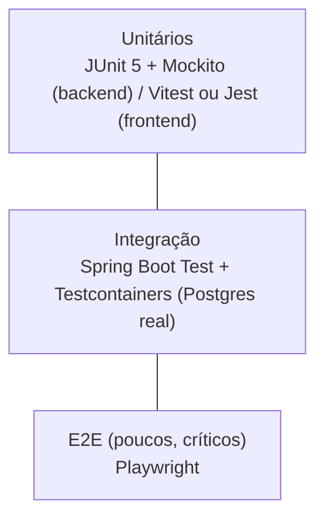

# TEST_STRATEGY — Estratégia de Testes

Status: **Rascunho para aprovação**
Versão: 0.1.0

## 1. Princípio

Nenhuma fase do `ROADMAP.md` é considerada concluída com testes quebrados ou erros de compilação. Testes automatizados são parte da definição de pronto de cada fase, não uma etapa posterior opcional.

## 2. Pirâmide de testes

**[DECISÃO]** Uso de **Testcontainers** para testes de integração do backend que envolvem banco de dados — nunca H2 ou mocks de banco para regras que dependem de constraints reais do Postgres (ex.: índice único parcial de `question_option`, unicidade de `enrollment`). Isso evita falsos positivos onde um teste passa em H2 mas falharia em produção.

## 3. Backend (Java/Spring Boot)

- **Unitários (JUnit 5 + Mockito):** regras de negócio isoladas — cálculo de progresso, cálculo de pontuação, máquina de estados do `AiGenerationJob`, validação estrutural da saída da IA (`AiContentValidator`), elegibilidade de certificado.
- **Integração (Spring Boot Test + Testcontainers):** repositórios JPA (constraints reais do banco), controllers com contexto de segurança simulado (`@WithMockUser` ou equivalente com papéis customizados), fluxo completo de um endpoint (request → banco → response).
- **Contrato de API:** validação de que os controllers respeitam o schema OpenAPI gerado (evita drift entre documentação e implementação).

## 4. Frontend (Next.js/TypeScript)

- **Unitários/componentes:** biblioteca de testes de componente (ex.: Testing Library) para formulários, construtor curricular, player de estado de aula. **[PERGUNTA ABERTA]** Vitest vs. Jest — proposta padrão: Vitest, por integração mais leve com o toolchain moderno do Next.js/Vite-like.
- **E2E (Playwright):** fluxos críticos ponta a ponta (login, criação de curso até publicação, matrícula manual, aluno assistindo aula e concluindo, tentativa de quiz, emissão e validação pública de certificado).

## 5. Casos de teste mapeados aos requisitos (checklist funcional)

### Autenticação
- Cadastro com e-mail duplicado é rejeitado.
- Login com credenciais inválidas retorna erro genérico (sem indicar se o e-mail existe).
- Logout invalida o refresh token corrente.
- Recuperação de senha não revela se o e-mail está cadastrado (resposta neutra).
- Conta bloqueada não consegue autenticar, mas seus dados históricos permanecem consultáveis por quem tem permissão.

### Autorização por papel
- STUDENT não consegue chamar endpoints de criação/edição de curso/módulo/aula/questão (403).
- INSTRUCTOR não consegue editar curso de outro INSTRUCTOR (403 por falha de posse, não só de papel).
- SUPER_ADMIN consegue operar sobre qualquer curso.
- Endpoints administrativos exigem papel explícito mesmo que o frontend não exiba o botão correspondente.

### CRUD de cursos
- Criar, editar, salvar como rascunho, publicar, despublicar, arquivar — todas as transições válidas e ao menos uma transição inválida testada (ex.: publicar curso sem módulos, se essa regra existir — **a confirmar**).
- Curso arquivado não aparece em listagens ativas.

### Ordenação de módulos e aulas
- Reordenar duas vezes seguidas com a mesma lista não corrompe `order_index` (idempotência).
- Reordenação parcial (nem todos os IDs do módulo enviados) é rejeitada ou tratada de forma explícita e testada.

### Matrículas
- Aluno sem matrícula não acessa curso/aula restrita.
- Matrícula suspensa bloqueia acesso imediatamente.
- Matrícula expirada (`expires_at` no passado) bloqueia acesso.
- Não é possível criar duas matrículas ativas para o mesmo par aluno/curso (constraint + teste).

### Progresso
- Aluno não altera progresso de outro aluno (tentativa com `enrollmentId` de terceiro retorna 403).
- Progresso do módulo/curso recalcula corretamente após concluir cada aula.
- Retomada de vídeo usa `last_position_seconds` persistido corretamente.

### Correção de exercícios
- Resposta correta calcula `is_correct = true`; resposta incorreta calcula `false`, comparando exclusivamente com `question_option.is_correct`.
- Tentativa finalizada (`SUBMITTED`/`GRADED`) rejeita qualquer tentativa de alteração posterior.
- Nova tentativa só é permitida dentro do limite configurado (`max_attempts`).
- Pontuação calculada corretamente em casos de borda (0 acertos, todos corretos, número ímpar de questões).

### Critérios de certificado
- Certificado não é emitido se conclusão de aulas estiver abaixo do mínimo configurado.
- Certificado não é emitido se exercícios obrigatórios não estiverem completos.
- Certificado não é emitido se nota mínima não for atingida.
- Certificado é emitido corretamente quando todos os critérios são cumpridos simultaneamente.
- Dados do certificado são snapshot: alterar o nome do curso depois não muda um certificado já emitido.

### Validação do JSON da IA
- Saída fora do schema é rejeitada integralmente.
- Questão com menos/mais de 4 alternativas é descartada individualmente.
- Questão com 0 ou 2+ alternativas corretas é descartada.
- Questão com evidência que não corresponde a nenhum trecho da transcrição é descartada.
- Enunciados duplicados dentro do mesmo lote são descartados (mantendo apenas uma ocorrência ou nenhuma, conforme regra definida).

### Falhas de transcrição e geração
- Falha do provedor de transcrição marca o job como `FAILED` com mensagem segura, sem quebrar o restante da aplicação.
- Falha parcial de geração (algumas questões válidas, outras não) mantém apenas as válidas e reporta o restante.
- Job travado por tempo excessivo é identificado pelo agendador e tratado (retomado ou marcado como falho).

### Reprocessamento e idempotência
- Reenviar a mesma `idempotencyKey` não cria um segundo `AiGenerationJob` nem questões duplicadas.
- "Gerar novamente" cria um novo job independente, sem afetar questões já aprovadas do job anterior.
- Processamento concorrente (dois workers tentando pegar o mesmo job) não resulta em duplo processamento (`FOR UPDATE SKIP LOCKED`).

### Tentativas duplicadas
- Duas submissões simultâneas da mesma tentativa não geram dois registros de pontuação/resultado divergentes (constraint de unicidade + transação).

### Acesso indevido a cursos
- Aluno não matriculado recebe 403/404 (a definir qual, para não vazar existência do curso — **[PERGUNTA ABERTA]**) ao tentar acessar curso restrito diretamente pela API.

### Acesso indevido a vídeos
- URL de vídeo não pode ser reutilizada indefinidamente após expiração (teste de expiração de URL assinada).
- Usuário sem matrícula não consegue obter `stream-url` mesmo conhecendo o `videoAssetId`.

### Validação pública de certificados
- Código inválido retorna resposta genérica (não vaza se o código "quase existe").
- Certificado revogado é sinalizado como inválido/revogado na resposta pública.
- Resposta pública nunca inclui e-mail, UUID interno ou dados de outras matrículas do aluno.

## 6. Cobertura e critérios de qualidade

**[PERGUNTA ABERTA]** Nenhuma meta numérica de cobertura de código foi definida pelo usuário. Proposta a confirmar: cobertura mínima de linha/branch em módulos de regra de negócio crítica (correção de exercícios, elegibilidade de certificado, validação de IA, autorização) — sugestão inicial 80%, sem meta rígida para camadas triviais (DTOs, mapeamentos simples).

## 7. CI

**[PERGUNTA ABERTA]** Ferramenta de CI não confirmada (proposta: GitHub Actions, dado que o repositório está no GitHub). Pipeline mínimo sugerido por fase: build backend + testes (com Testcontainers), build frontend + testes, lint (ambos), verificação de que nenhuma migração Flyway conflitante foi introduzida.

## 8. Documentos relacionados

`ROADMAP.md` (testes exigidos por fase), `SECURITY.md` §10 (riscos que originam casos de teste), `AI_PIPELINE.md` (regras de validação testadas).
